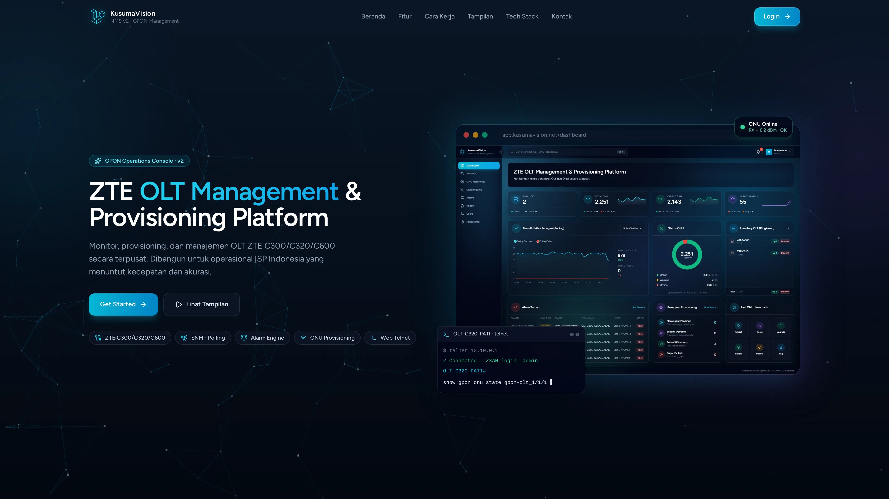
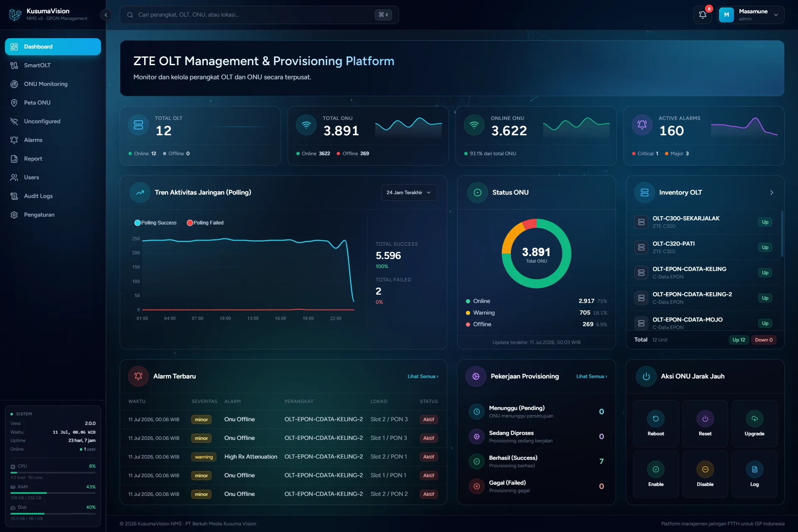
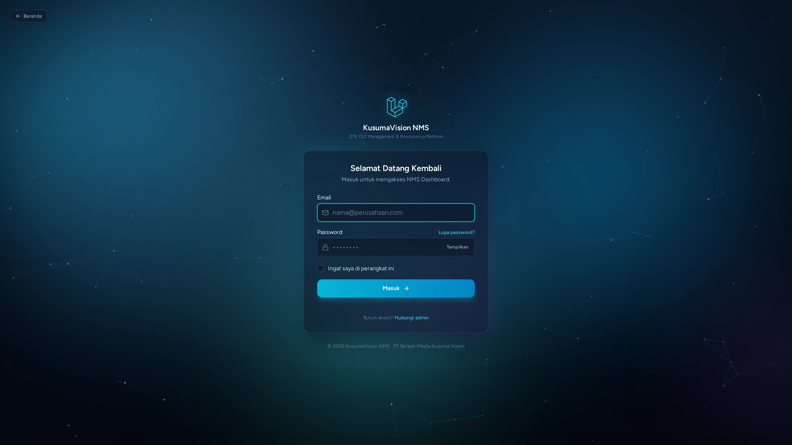
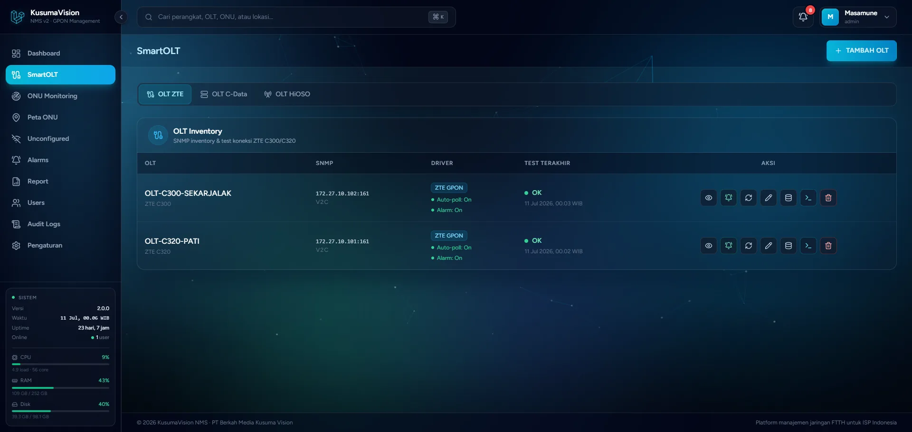
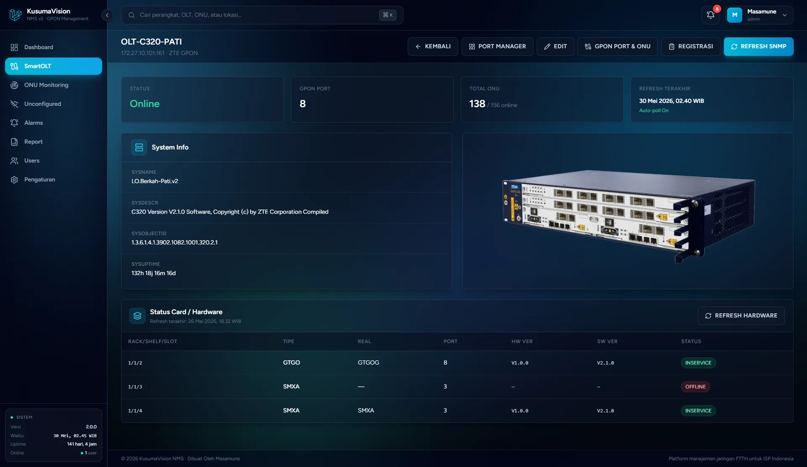
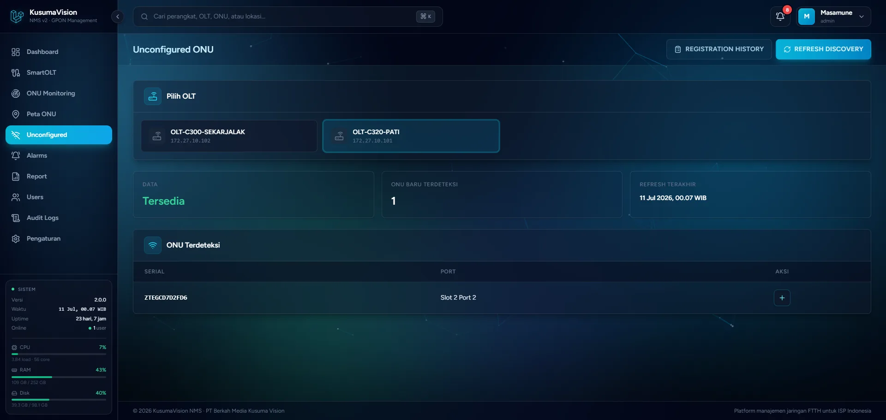

# KusumaVision NMS

**Unified FTTH Network Management Platform** — PT Berkah Media Kusuma Vision (BMKV).

Platform manajemen jaringan FTTH berbasis web untuk mengelola OLT GPON **ZTE C300/C320/C600 (ZXA10)**: monitoring OLT/ONU, provisioning ONU, remote management, background polling, alarm engine, dan dashboard. Dibangun sebagai alternatif modern untuk SmartOLT/NetNumen bagi ISP FTTH di Indonesia.

> Riwayat pengembangan per fase: [`WORKLOG.md`](WORKLOG.md).
> Dokumentasi teknis lengkap (arsitektur, routing, skema DB, SNMP/CLI, troubleshooting, panduan menambah fitur): **[`docs/handbook/`](docs/handbook/README.md)**.

---

## Tampilan Aplikasi

> UI dark-glass bertema cyan/sky — landing, dashboard terpusat, manajemen OLT, dan provisioning ONU.





| Login | SmartOLT — Inventory OLT |
|---|---|
|  |  |

| Detail OLT (system info & status card) | Discovery ONU unconfigured |
|---|---|
|  |  |

---

## Fitur

### Inventory & Monitoring

- **Inventory OLT** — CRUD OLT, uji koneksi SNMP, kredensial tersimpan terenkripsi.
- **Monitoring** — GPON port (up/down), ONU per port (online/offline, phase state, RX power via SNMP), search ONU langsung dari halaman Detail.
- **ONU Monitoring (lintas OLT)** — halaman terpusat memantau seluruh ONU dari semua OLT & port dalam satu tabel, dengan filter OLT, port, status (online/LOS/dying-gasp/offline) dan admin; scan ulang seluruh ONU per-OLT dalam satu walk SNMP.
- **Discovery ONU unconfigured** — temukan ONU baru via OID ZTE, langsung ke form provisioning.
- **Dashboard** — ringkasan OLT/ONU/alarm dengan grafik (ApexCharts); status ONU *Warning* dihitung dari RX power ONU online di luar zona aman (-25…-10 dBm).
- **Global search (⌘K)** — cari OLT/ONU instan berdasarkan serial number, nama pelanggan, atau interface.

### Provisioning & ONU

- **Provisioning ONU** — VLAN, T-CONT, PPPoE/DHCP/Static, TR069, Remote ONT; tersimpan sebagai audit log lalu dieksekusi via Telnet.
- **Detail ONU (CLI)** — baca `show gpon onu detail-info` + `show pon power attenuation`, divisualisasikan: gauge RX power berzona warna, bar atenuasi up/down, chip metrik optik (temperature/voltage/bias), status & last-event.
- **Configure ONU (CLI)** — reconfigure ONU existing dari live running-config dengan **delta script** (hanya baris yang berubah), preview live + panel *what will change*, lalu apply via Telnet (audit `reconfigured`/`reconfig_failed`).
- **Manajemen Profile** — ONU Type / T-CONT / VLAN / IP per-OLT, sinkronisasi langsung dari OLT.
- **Remote ONU Management** — reboot (CLI), enable/disable & edit nama/deskripsi (SNMP SET).
- **Telnet via Browser** — terminal interaktif (xterm.js) ke CLI OLT langsung dari browser lewat proxy WebSocket↔Telnet; jendela bisa digeser, minimize/maximize, auto-login dengan kredensial OLT tersimpan.

### Polling, Alarm & Notifikasi

- **Background polling** — interval poll per-OLT yang dapat dikonfigurasi (default 5 menit), RX power di-poll pada interval terpisah.
- **Alarm engine** — siklus raise/clear berbasis transisi untuk `olt_unreachable`, `port_down`, `los`, `onu_offline`, `dying_gasp`, `high_rx_attenuation` (alarm RX pakai hysteresis/deadband agar tak flapping).
- **Notifikasi Telegram** — kirim notifikasi alarm (saat muncul / saat pulih) ke satu atau banyak chat via Telegram Bot API, dengan filter severity minimum. Di-hook di titik raise/clear sehingga semua sumber polling ikut memicu.
- **Bot Telegram (perintah inbound)** — webhook **read-only**: balas data jaringan (`/status /olt /alarm /onu /prov`) hanya untuk chat terdaftar; chat lain hanya `/start /help /id /ping`. Diamankan dengan secret token Telegram.

### Administrasi & Pelaporan

- **Role-based access control (RBAC)** — 3 role: **admin** (kelola user/pengaturan/audit), **operator** (semua operasi OLT/ONU), **demo** (read-only).
- **Mode Demo** — data demo terisolasi (flag `is_demo` + global scope): user demo hanya melihat OLT/alarm/laporan dummy, terpisah dari data produksi pada instance yang sama.
- **Manajemen User** — CRUD user + assign role; guard admin terakhir agar akun tak terkunci.
- **Report** — 5 jenis laporan (inventaris ONU, status OLT, riwayat alarm, provisioning, RX power) dengan filter range/OLT/PON port; export **CSV** & **PDF** berbranding.
- **Audit Logs** — jejak audit *immutable* (append-only): perubahan model, login/logout/login gagal, pembukaan telnet; secret tak pernah dicatat, bisa difilter & di-expand untuk lihat diff lama→baru. Admin-only.
- **Pengaturan** — branding aplikasi (nama, versi, logo) + konfigurasi Bot Telegram. Admin-only.

---

## Stack Teknologi

| Lapisan | Teknologi |
|---|---|
| Backend | Laravel 12 (PHP 8.3), Inertia.js |
| Frontend | Vue 3 + Inertia, TailwindCSS, ApexCharts, xterm.js (terminal) |
| Database | PostgreSQL |
| Cache / Queue / Session | Redis |
| Web Server | Nginx + PHP-FPM 8.3 |
| Akses OLT | SNMP v1/v2c (read & write), CLI Telnet, telnet interaktif via browser (proxy WebSocket↔Telnet) |
| SNMP Poller (opsional) | Go 1.18+ — binary `bin/kv-snmp-poller` |
| Notifikasi | Telegram Bot API (notifikasi alarm + bot perintah read-only) |
| Export laporan | CSV, PDF (`barryvdh/laravel-dompdf`) |

---

## Persyaratan

- PHP **8.3** + PHP-FPM 8.3
- Composer, Node.js **22**, npm
- PostgreSQL, Redis
- Nginx
- UFW / firewall host
- Ekstensi PHP: `bcmath ctype curl dom fileinfo intl mbstring openssl pcntl pdo_pgsql pdo_sqlite redis snmp tokenizer xml zip`
- Go **1.18+** (opsional — diperlukan hanya jika ingin build binary Go SNMP poller)

> 💡 Di server Ubuntu kosong, seluruh runtime + setup bisa dipasang otomatis dengan satu perintah —
> lihat [Cara Cepat (`install.sh`)](#cara-cepat-installsh--server-ubuntu-kosong) di bawah.

---

## Instalasi (Ubuntu 22.04 / 24.04)

### Cara Cepat (`install.sh`) — server Ubuntu kosong

Untuk deploy **satu perintah** di server Ubuntu fresh, gunakan skrip [`install.sh`](install.sh).
Skrip memasang seluruh runtime (PHP 8.3, Composer, Node 22, PostgreSQL, Redis, Nginx, Supervisor,
Go, Net-SNMP), membuat database + `.env`, build frontend & Go poller, migrasi, lalu mendaftarkan
daemon Supervisor (worker, scheduler, telnet-proxy) + Nginx site, dan opsional membuat akun admin.

```bash
cd /var/www
git clone git@github.com:Masamune21-dev/KusumaVisionNMS.git KusumaVisionNMS
cd KusumaVisionNMS

sudo bash install.sh                 # interaktif (tanya APP_URL, DB, akun admin)

# atau non-interaktif:
sudo APP_URL=http://nms.example.com \
     ADMIN_EMAIL=admin@bmkv.net ADMIN_PASSWORD='P@ssw0rd123' \
     ENABLE_UFW=1 bash install.sh --yes
```

Opsi lain: `sudo bash install.sh --help`. Skrip aman dijalankan ulang (idempotent). Setelah selesai
verifikasi dengan `bash scripts/check-requirements.sh`.

> Bila ingin memahami/melakukan setiap langkah secara manual (atau untuk environment dev),
> ikuti **Langkah 1–9** di bawah.

---

### Langkah 1 — Clone repo

```bash
cd /var/www
git clone git@github.com:Masamune21-dev/KusumaVisionNMS.git KusumaVisionNMS
cd KusumaVisionNMS
```

### Langkah 2 — Cek requirement

Setelah clone, jalankan script cek requirement yang sudah tersedia:

```bash
bash scripts/check-requirements.sh
```

Script memeriksa **versi minimum** tool (PHP, Composer, Node.js, npm, Go, PostgreSQL, Redis, SNMP),
semua **ekstensi PHP** wajib, serta — bila dijalankan setelah deploy — **artefak runtime** (binary
Go poller, build frontend, `.env`/`APP_KEY`) dan **status service/daemon**. `[OK]` = lolos,
`[MISS]` = requirement wajib kurang (gagalkan), `[WARN]` = info (tidak menggagalkan).

**Jika ada yang `[MISS]`, install dulu:**

```bash
# Update package list
apt update

# Nginx + PHP 8.3 + semua ekstensi
apt install -y nginx php8.3 php8.3-fpm php8.3-cli \
    php8.3-bcmath php8.3-curl php8.3-dom php8.3-intl \
    php8.3-mbstring php8.3-pgsql php8.3-redis php8.3-snmp \
    php8.3-xml php8.3-zip php8.3-sqlite3 \
    postgresql redis-server curl unzip git supervisor ufw

# Composer
curl -sS https://getcomposer.org/installer | php -- --install-dir=/usr/local/bin --filename=composer

# Node.js 22
curl -fsSL https://deb.nodesource.com/setup_22.x | bash -
apt install -y nodejs
```

Setelah install, jalankan ulang script untuk konfirmasi semua sudah `[OK]`:

```bash
bash scripts/check-requirements.sh
```

### Langkah 3 — Siapkan database PostgreSQL

```bash
su - postgres -c "psql -c \"CREATE USER kusumavision WITH PASSWORD 'ganti_password_ini';\""
su - postgres -c "psql -c \"CREATE DATABASE kusumavision_nms OWNER kusumavision;\""
```

### Langkah 4 — Konfigurasi environment

```bash
cp .env.example .env
```

Edit `.env` sesuai server:

```dotenv
APP_NAME="KusumaVision NMS"
APP_ENV=production
APP_DEBUG=false
APP_URL=http://ip-server-anda
LOG_LEVEL=warning

DB_CONNECTION=pgsql
DB_HOST=127.0.0.1
DB_PORT=5432
DB_DATABASE=kusumavision_nms
DB_USERNAME=kusumavision
DB_PASSWORD=ganti_password_ini

CACHE_STORE=redis
SESSION_DRIVER=redis
SESSION_ENCRYPT=true
QUEUE_CONNECTION=redis
REDIS_HOST=127.0.0.1
REDIS_PORT=6379
```

### Langkah 5 — Setup aplikasi

Satu perintah menangani seluruh setup: install dependensi PHP & JS, generate key, migrasi database, dan build aset:

```bash
composer setup
```

Perintah ini menjalankan secara berurutan:
1. `composer install`
2. Salin `.env.example` → `.env` (jika belum ada)
3. `php artisan key:generate`
4. `php artisan migrate --force`
5. `npm install`
6. `npm run build`

Setelah selesai, set permission storage:

```bash
chown -R www-data:www-data storage bootstrap/cache
chmod -R 775 storage bootstrap/cache
php artisan storage:link
php artisan optimize
```

### Langkah 6 — Queue Worker (Supervisor)

```bash
nano /etc/supervisor/conf.d/kusumavision-worker.conf
```

Isi dengan:

```ini
[program:kusumavision-worker]
process_name=%(program_name)s_%(process_num)02d
command=php /var/www/KusumaVisionNMS/artisan queue:work redis --tries=1 --timeout=120 --sleep=3
autostart=true
autorestart=true
user=www-data
numprocs=2
redirect_stderr=true
stdout_logfile=/var/log/supervisor/kusumavision-worker.log
stopwaitsecs=120
```

```bash
supervisorctl reread && supervisorctl update && supervisorctl start kusumavision-worker:*
```

### Langkah 7 — Laravel Scheduler (Supervisor)

Rekomendasi production lokal adalah menjalankan scheduler via Supervisor agar mudah dipantau:

```ini
[program:kusumavision-scheduler]
command=php /var/www/KusumaVisionNMS/artisan schedule:work
directory=/var/www/KusumaVisionNMS
autostart=true
autorestart=true
user=www-data
redirect_stderr=true
stdout_logfile=/var/www/KusumaVisionNMS/storage/logs/scheduler.log
```

```bash
supervisorctl reread && supervisorctl update && supervisorctl start kusumavision-scheduler
```

> Scheduler menjalankan `olts:poll` setiap menit. Setiap OLT hanya benar-benar di-poll sesuai interval masing-masing (`poll_interval_minutes`).

Alternatif cron tetap bisa dipakai:

```cron
* * * * * php /var/www/KusumaVisionNMS/artisan schedule:run >> /dev/null 2>&1
```

### Langkah 8 — Telnet Proxy Browser (Supervisor + Nginx)

Daemon WebSocket↔Telnet untuk fitur terminal di browser. Bind ke localhost, diakses lewat Nginx (tidak perlu membuka port baru di firewall).

```ini
[program:kusumavision-telnet-proxy]
command=php /var/www/KusumaVisionNMS/artisan telnet:proxy
directory=/var/www/KusumaVisionNMS
autostart=true
autorestart=true
user=www-data
redirect_stderr=true
stdout_logfile=/var/www/KusumaVisionNMS/storage/logs/telnet-proxy.log
stopwaitsecs=5
```

```bash
supervisorctl reread && supervisorctl update && supervisorctl start kusumavision-telnet-proxy
```

Tambahkan route WebSocket di server block Nginx (di dalam `server { ... }`), lalu `nginx -t && systemctl reload nginx`:

```nginx
location /telnet-ws {
    proxy_pass http://127.0.0.1:6002;
    proxy_http_version 1.1;
    proxy_set_header Upgrade $http_upgrade;
    proxy_set_header Connection "upgrade";
    proxy_set_header Host $host;
    proxy_read_timeout 3600s;
}
```

Set di `.env` (jalankan `php artisan config:cache` setelahnya):

```dotenv
TELNET_PROXY_HOST=127.0.0.1
TELNET_PROXY_PORT=6002
TELNET_PROXY_WS_URL=/telnet-ws   # path relatif → scheme/host (ws/wss) otomatis dari request
```

> Tombol **Telnet** muncul di halaman SmartOLT untuk OLT dengan `cli_transport=telnet` (role admin/operator). Daemon long-lived — restart (`supervisorctl restart kusumavision-telnet-proxy`) setelah mengubah kode/konfigurasi telnet.

### Langkah 9 — Buat akun pertama

Registrasi publik dinonaktifkan. Buat user pertama lewat Artisan:

```bash
php artisan user:create --name="Admin BMKV" --email="admin@bmkv.net" --password="P@ssw0rd123"
```

---

## Instalasi Go SNMP Poller (opsional)

> Lewati jika ingin tetap menggunakan PHP poller (default).
> Karena repo Laravel memiliki folder `vendor/`, jalankan command Go dengan `-mod=mod`.

```bash
# Install Go 1.22
wget https://go.dev/dl/go1.22.5.linux-amd64.tar.gz
tar -C /usr/local -xzf go1.22.5.linux-amd64.tar.gz
echo 'export PATH=$PATH:/usr/local/go/bin' >> /etc/profile.d/go.sh
source /etc/profile.d/go.sh

# Build binary
go mod download
go build -mod=mod -o bin/kv-snmp-poller ./cmd/kv-snmp-poller
chmod +x bin/kv-snmp-poller
```

Aktifkan di `.env`:

```dotenv
SNMP_POLLER_DRIVER=go
SNMP_POLLER_BINARY=bin/kv-snmp-poller
```

> Jika binary tidak ditemukan atau tidak executable, sistem otomatis fallback ke PHP poller.

---

## Notifikasi & Bot Telegram (opsional)

Konfigurasi dilakukan dari UI **Pengaturan → Bot Telegram** (admin-only) — tidak perlu mengedit `.env`.

**Notifikasi alarm (outbound):**

1. Buat bot via [@BotFather](https://t.me/BotFather), salin **bot token**.
2. Dapatkan **chat ID** via [@userinfobot](https://t.me/userinfobot) (bisa banyak ID dipisah koma).
3. Di Pengaturan: aktifkan, isi token + chat ID, pilih severity minimum, simpan, lalu **Kirim Tes**.

**Bot perintah (inbound, read-only):**

Bot bisa menerima perintah (`/status /olt /alarm /onu /prov`) lewat webhook. Karena Telegram mengirim `POST` ke server, perlu URL HTTPS publik valid (`APP_URL`) dan nginx meneruskan `POST /telegram/webhook` ke aplikasi.

1. Di Pengaturan, centang **Aktifkan perintah bot**, lalu klik **Daftarkan Webhook** (atau `php artisan telegram:webhook set`).
2. Cek status: `php artisan telegram:webhook info`. Hapus: `php artisan telegram:webhook delete`.

> Perintah data hanya dilayani untuk **chat terdaftar**; chat lain hanya bisa `/start /help /id /ping`. Semua perintah read-only (tidak ada aksi tulis ke OLT). Webhook divalidasi dengan secret token Telegram.

---

## Menjalankan di Development

```bash
composer dev
```

Menjalankan server + queue + log + Vite secara paralel. Atau pisah per proses:

```bash
php artisan serve --host=0.0.0.0 --port=8000
npm run dev
php artisan queue:work
php artisan schedule:work
```

---

## Perintah Berguna

```bash
php artisan olts:poll             # dispatch poll semua OLT yang sudah due sekarang
php artisan telnet:proxy          # daemon WebSocket<->telnet (terminal browser)
php artisan config:clear --ansi   # clear config sebelum test
php artisan test                  # jalankan test suite (SQLite in-memory)
php artisan optimize              # cache config/routes/views untuk production
./vendor/bin/pint                 # format kode PHP
npm run build                     # build aset produksi
composer audit                    # audit advisory Composer
npm audit --omit=dev              # audit dependency runtime frontend
```

## Production Lokal & Hardening

Panduan hardening OS/aplikasi tersedia di [`docs/LOCAL_PRODUCTION_HARDENING.md`](docs/LOCAL_PRODUCTION_HARDENING.md).

Ringkasan konfigurasi production lokal yang direkomendasikan:

- Laravel: `APP_ENV=production`, `APP_DEBUG=false`, `SESSION_ENCRYPT=true`, `php artisan optimize`.
- File secret: `.env` tidak masuk Git dan permission `640 root:www-data`.
- Nginx: root harus ke `public/`, deny dotfiles/file sensitif, security headers aktif, allow-list IP dibatasi.
- SSH: key-only (`PasswordAuthentication no`), root hanya via key (`PermitRootLogin prohibit-password`), X11 forwarding off.
- UFW: default deny incoming, allow outgoing, buka hanya port yang diperlukan dari subnet tepercaya.
- Queue/scheduler/telnet-proxy: jalankan via Supervisor dan pastikan `queue:work`, `schedule:work`, serta `telnet:proxy` aktif.
- Config cache: app jalan dengan `bootstrap/cache/config.php`. Setelah mengubah `.env`/config, jalankan `php artisan config:cache` lalu restart daemon Supervisor — **jangan tinggalkan config dalam keadaan ter-clear** (bila `.env` tidak terbaca `www-data`, situs bisa 500).

---

## Catatan & Batasan

- **Vendor:** ZTE C300/C320 dan C600 (ZXA10). OLT C600 terdeteksi otomatis dari nama/vendor mengandung `"c600"` dan menggunakan OID `.1082` serta interface 4-tier. OLT non-ZTE terdeteksi sebagai `unknown` dengan kapabilitas dimatikan.
- **SNMP:** v1/v2c saja (v3 belum didukung). Fitur enable/disable & edit info ONU butuh **write community** terisi.
- **CLI:** eksekusi provisioning/reboot hanya via **Telnet** (`cli_transport=telnet`).
- **Poll interval:** per-OLT, dapat diubah di form Edit OLT. Default 5 menit untuk polling SNMP, 5 menit untuk RX power.
- **Akses (RBAC):** 3 role — `admin` (kelola user/pengaturan/audit), `operator` (operasi OLT/ONU), `demo` (read-only). Registrasi publik dinonaktifkan; user dibuat via `php artisan user:create` atau halaman Users (admin).
- **Mode Demo:** data demo (`is_demo`) hidup di DB yang sama tapi terisolasi via global scope. Seed dengan `php artisan db:seed --class=DemoSeeder --force` (lihat [`docs/DEMO_DEPLOYMENT.md`](docs/DEMO_DEPLOYMENT.md)). Scheduler hanya memoll OLT nyata.
- **Telegram bot webhook** butuh URL HTTPS publik + nginx meneruskan `POST /telegram/webhook` (di-exempt dari CSRF).
- Dashboard & alarm seakurat poll terakhir — pastikan queue worker dan cron scheduler aktif.

---

## Dokumentasi

- **[Developer Handbook](docs/handbook/README.md)** — dokumentasi teknis lengkap & terbagi per-bagian:
  arsitektur, struktur folder, [instalasi & deploy](docs/handbook/04-instalasi-deploy.md),
  [skema database & model](docs/handbook/05-database-model.md), [routing](docs/handbook/06-routing.md),
  [modul & fitur](docs/handbook/07-modul-fitur.md), [SNMP & polling](docs/handbook/08-snmp-polling.md),
  [CLI & telnet](docs/handbook/09-cli-telnet.md), [alarm & Telegram](docs/handbook/10-alarm-telegram.md),
  [keamanan/RBAC/audit](docs/handbook/11-keamanan-rbac-audit.md), [frontend](docs/handbook/12-frontend.md),
  [troubleshooting](docs/handbook/13-troubleshooting-maintenance.md), dan
  [panduan menambah fitur](docs/handbook/14-panduan-tambah-fitur.md).
- [`docs/SMARTOLT_ZTE_C300_C320_GUIDE.md`](docs/SMARTOLT_ZTE_C300_C320_GUIDE.md) — referensi otoritatif perintah CLI ZTE.
- [`docs/LOCAL_PRODUCTION_HARDENING.md`](docs/LOCAL_PRODUCTION_HARDENING.md) — hardening produksi (nginx/UFW/SSH/PHP-FPM).
- [`docs/DEMO_DEPLOYMENT.md`](docs/DEMO_DEPLOYMENT.md) — penyiapan data & mode demo.
- [`WORKLOG.md`](WORKLOG.md) — riwayat pekerjaan fase per fase.

---

## Lisensi

Proprietary — PT Berkah Media Kusuma Vision (BMKV). Lihat [`LICENSE`](LICENSE).
