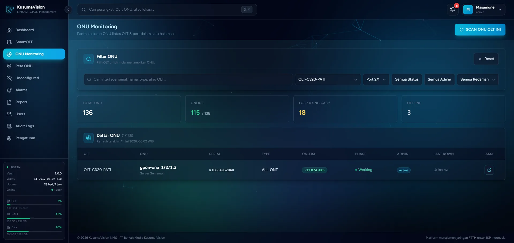
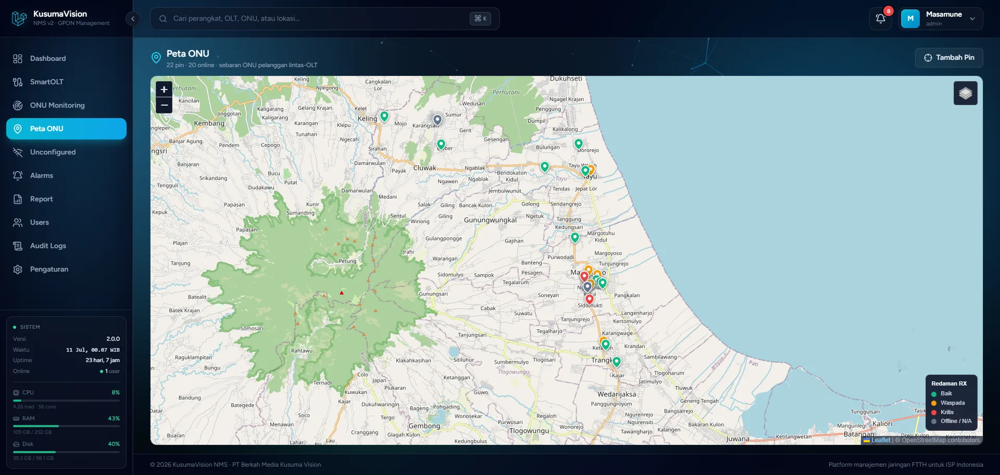
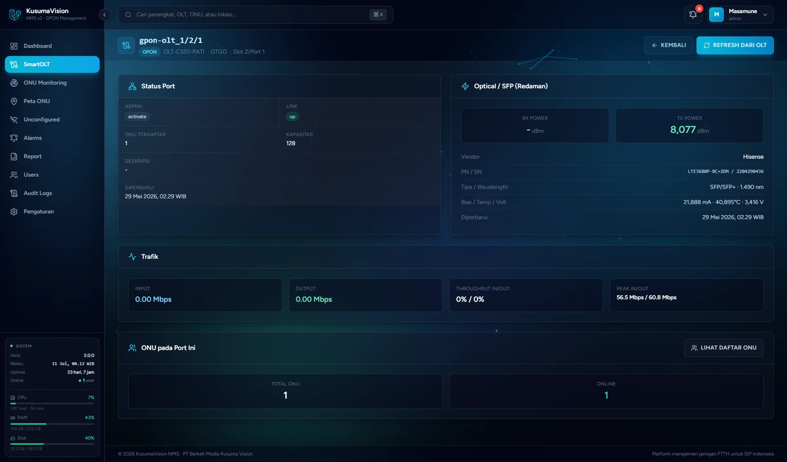
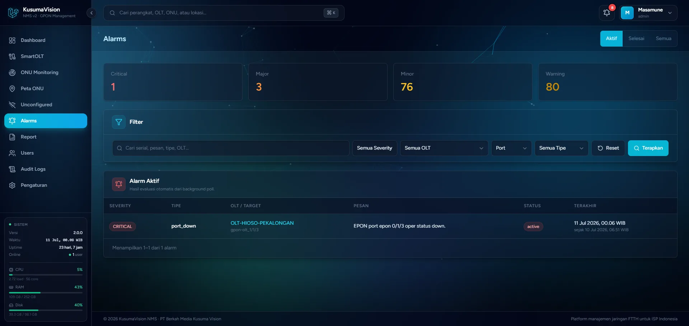

<div align="center">

# KusumaVision NMS


[](https://github.com/Masamune21-dev/KusumaVisionNMS)

**Unified FTTH Network Management Platform** — PT Berkah Media Kusuma Vision (BMKV).

Platform manajemen jaringan FTTH berbasis web untuk mengelola OLT **ZTE C300/C320/C600**, **C-Data (EPON/GPON)**, dan **HiOSO/V-Sol EPON**: monitoring OLT/ONU, provisioning ONU, remote management, alarm + notifikasi Telegram & push Android, peta pelanggan, dan dashboard. Alternatif modern untuk SmartOLT/NetNumen bagi ISP FTTH di Indonesia.

</div>

> ⭐ **Bantu Starnya Bang.** 

---

## Tampilan Aplikasi


| ONU Monitoring (lintas OLT) | Peta ONU (sebaran pelanggan) |
|---|---|
|  |  |

| Detail Port PON | Alarm Center |
|---|---|
|  |  |

---

## Fitur Utama

- **Multi-vendor OLT** — ZTE C300/C320/C600 (ZXA10/Titan), C-Data EPON/GPON, HiOSO/V-Sol EPON; deteksi otomatis, tab terpisah per-vendor.
- **Monitoring** — port PON, status ONU (online/LOS/dying-gasp/offline), RX power, faceplate, ONU Monitoring lintas OLT, global search (⌘K), dashboard grafik, deskripsi port PON (edit langsung via CLI dari dashboard).
- **Provisioning ONU (ZTE)** — discovery ONU unconfigured → registrasi (VLAN, T-CONT, PPPoE/DHCP/Static/Bridge, TR069), reconfigure via delta script, manajemen profile per-OLT — **termasuk C600** (mode Model B/SmartOLT TR069, alokasi mgmt-IP otomatis, dropdown profil dari katalog).
- **Remote ONU** — reboot, rename, enable/disable, delete, TR069 massal per-port, dan **terminal Telnet langsung di browser**.
- **Alarm & notifikasi** — alarm engine raise/clear (anti-flap + korelasi root-cause), notifikasi **Telegram** & **push FCM** ke aplikasi Android, bot Telegram read-only.
- **Peta ONU & ODP** — sebaran pelanggan di peta (Leaflet), tambah pin dari link Google Maps, **pin ODP (splitter)** dengan garis kabel animasi ODP→ONU, kolom ODP di tabel ONU semua vendor.
- **Administrasi** — RBAC (admin/operator/partner/demo), audit log immutable, report CSV/PDF, backup config OLT terjadwal + save config ke memori OLT (semua vendor), **REST API v1** untuk integrasi.
- **Aplikasi Android** — monitoring (termasuk deskripsi port), registrasi ONU, reboot/rename, alarm + push notification ([`mobile/`](mobile/), Flutter).

**Stack:** Laravel 12 (PHP 8.3) + Vue 3/Inertia + TailwindCSS · PostgreSQL + Redis · Go SNMP poller · SNMP v1/v2c + CLI Telnet · Flutter (Android).

---

## Instalasi

Pilih salah satu dari dua cara — dua-duanya otomatis:

### Cara 1 — Docker (Windows / Linux / macOS)

Seluruh stack jalan sebagai container, data persist di volume. Butuh Docker Desktop/Engine, RAM ≥ 4 GB.

```bash
cp .env.docker.example .env      # sekali; edit DB_PASSWORD & admin
docker compose up -d --build     # pertama kali agak lama
# buka http://localhost:8080
```

Windows: cukup double-click **`start.bat`**. Panduan lengkap: [`docs/DOCKER.md`](docs/DOCKER.md).

### Cara 2 — Server Ubuntu 22.04/24.04 (satu perintah)

`install.sh` memasang semuanya otomatis (PHP, PostgreSQL, Redis, Nginx, Supervisor, Go poller, migrasi, daemon). Butuh server Ubuntu kosong, RAM ≥ 2 GB.

```bash
cd /var/www
sudo mkdir -p KusumaVisionNMS && sudo chown "$USER:$USER" KusumaVisionNMS
git clone https://github.com/Masamune21-dev/KusumaVisionNMS.git KusumaVisionNMS
cd KusumaVisionNMS

sudo bash install.sh             # interaktif (tanya APP_URL, DB, akun admin)
```

Skrip aman dijalankan ulang (idempotent). Verifikasi: `bash scripts/check-requirements.sh`.

### Setelah instalasi

1. Buat akun admin (jika belum): `php artisan user:create --name="Admin" --email=admin@bmkv.net --password=PASSWORD_KUAT`
2. Login → menu **SmartOLT** → tambah OLT → **Test SNMP**.
3. Opsional dari menu **Pengaturan**: notifikasi Telegram, ACS/TR069, token API, push mobile.

> 📖 Minimum spek, instalasi manual langkah-demi-langkah, dan troubleshooting: **[`docs/INSTALL.md`](docs/INSTALL.md)**.
> Aplikasi **Android (APK)**: unduh APK jadi dari `https://<host>/downloads/kusumavision-nms.apk`, atau build sendiri via [`docs/BUILD_APK.md`](docs/BUILD_APK.md).

---

## Dokumentasi

- [`docs/INSTALL.md`](docs/INSTALL.md) — panduan master instalasi (semua jalur + minimum spek).
- [`docs/handbook/`](docs/handbook/README.md) — **Developer Handbook**: arsitektur, skema DB, routing, SNMP/CLI, alarm, keamanan, troubleshooting, panduan menambah fitur.
- [`docs/DOCKER.md`](docs/DOCKER.md) — Docker appliance (backup, update, distribusi image).
- [`docs/API.md`](docs/API.md) — REST API v1 (endpoint, token, contoh kode).
- [`docs/BUILD_APK.md`](docs/BUILD_APK.md) — build & install aplikasi Android.
- Referensi OID/CLI per-vendor: [ZTE C300/C320](docs/SMARTOLT_ZTE_C300_C320_C600_GUIDE.md) · [ZTE C600](docs/SMARTOLT_ZTE_C600_GUIDE.md) · [C-Data](docs/SMARTOLT_CDATA_GUIDE.md) · [HiOSO](docs/SMARTOLT_HIOSO_GUIDE.md).
- [`WORKLOG.md`](WORKLOG.md) — riwayat pengembangan fase per fase.

---

## Komunitas & Dukungan

Punya pertanyaan, laporan bug, atau ingin berdiskusi? Gabung ke grup Telegram komunitas:

> 💬 **[Grup Telegram — KusumaVisionNMS-Share](https://t.me/+RMTs-9c028g0MDdl)**

Punya OLT yang belum didukung penuh (mis. varian firmware lain)? Laporan **output asli dari perangkat nyata** (snmpwalk / CLI, setelah disensor bagian sensitif) sangat membantu — aturan main kami: OID & perintah CLI hanya masuk kode setelah terverifikasi di perangkat asli. Kirim via grup Telegram atau GitHub Issues.

---

## ⭐ Dukung Proyek Ini

Proyek ini dikembangkan dan diuji langsung di jaringan FTTH produksi. Jika KusumaVision NMS bermanfaat untuk ISP/jaringan Anda:

- **Kasih star ⭐** di [GitHub](https://github.com/Masamune21-dev/KusumaVisionNMS) — membantu proyek ini ditemukan lebih banyak orang.
- Bagikan ke rekan ISP lain yang butuh alternatif SmartOLT/NetNumen.
- Laporkan bug / hasil uji perangkat Anda di grup Telegram atau Issues.

---

## Lisensi

Proprietary — PT Berkah Media Kusuma Vision (BMKV). Lihat [`LICENSE`](LICENSE).
