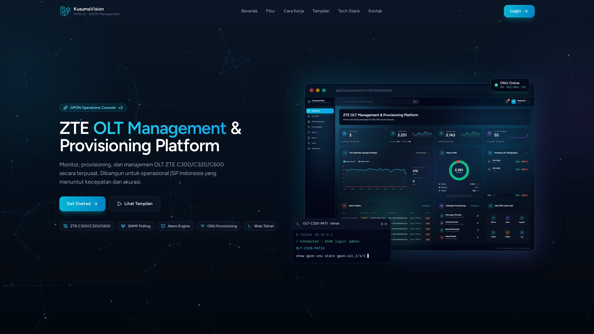
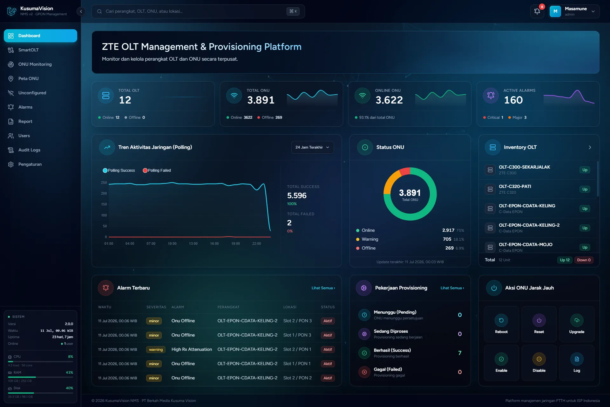
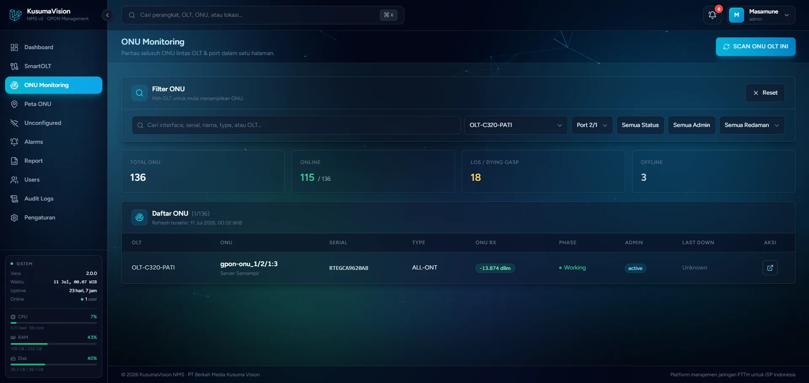
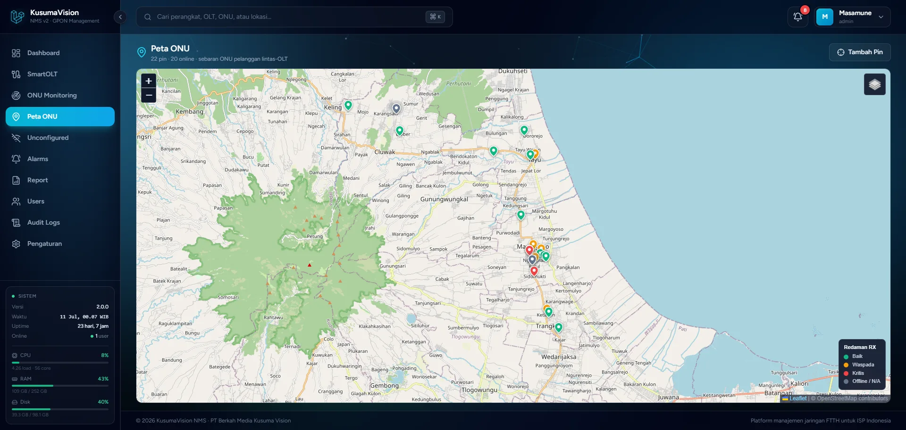
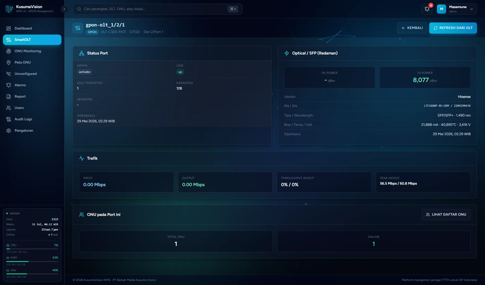
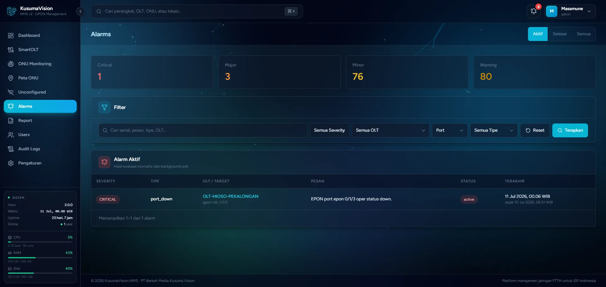

<div align="center">

# KusumaVision NMS


[](https://github.com/Masamune21-dev/KusumaVisionNMS)

**Unified FTTH Network Management Platform** — PT Berkah Media Kusuma Vision (BMKV).

A web-based FTTH network management platform for operating **ZTE C300/C320/C600**, **C-Data (EPON/GPON)**, and **HiOSO/V-Sol EPON** OLTs: OLT/ONU monitoring, ONU provisioning, remote management, alarms with Telegram and Android push notifications, a customer map, and dashboards. A modern open-source alternative to SmartOLT/NetNumen for FTTH ISPs.

</div>

> ⭐ **If this project helps your network, a star goes a long way.**

---

## Screenshots





| ONU Monitoring (across OLTs) | ONU Map (customer distribution) |
|---|---|
|  |  |

| PON Port Detail | Alarm Center |
|---|---|
|  |  |

---

## Key Features

- **Multi-vendor OLT support** — ZTE C300/C320/C600 (ZXA10/Titan), C-Data EPON/GPON, HiOSO/V-Sol EPON; automatic detection with a separate tab per vendor.
- **Monitoring** — PON ports, ONU state (online / LOS / power off / offline) with friendly bilingual labels, RX power, faceplate view, cross-OLT ONU monitoring (filter by OLT / port / state / **ODP**), customer name as the primary identity in ONU tables, global search (⌘K), dashboard charts, and PON port descriptions editable directly from the dashboard via CLI.
- **ONU provisioning (ZTE)** — discovery of unconfigured ONUs → registration (VLAN, T-CONT, PPPoE/DHCP/Static/Bridge, TR-069, **pick the ODP right at registration**), reconfiguration via delta scripts, per-OLT profile management — **including C600** (Model B / SmartOLT TR-069 mode, automatic management IP allocation, profile dropdown sourced from the catalog).
- **Remote ONU management** — reboot, rename, enable/disable, delete, bulk TR-069 per port, remote open/close of the ONT web UI (Remote ONT), and a **Telnet terminal directly in the browser**.
- **Alarms and notifications** — a raise/clear alarm engine with two-poll anti-flap confirmation and root-cause correlation, **clicking a notification opens the affected ONU/port/OLT** (it follows an ONU that moved ports and refuses to open a position now taken by a different customer), ONU-down alarms **grouped per ODP** on Telegram and FCM, **Telegram** notifications and **FCM push** to the Android app, plus a read-only Telegram bot.
- **ONU and ODP mapping** — customer distribution on a map (Leaflet), pins added by map click or Google Maps link, **lock/unlock pin position** (drag to reposition, saved automatically), **ODP (splitter) pins** with animated ODP→ONU cable lines, a **dedicated ODP page** (CRUD, filter by OLT / PON port, Manage ONUs modal), and an ODP column plus filter in the ONU table for every vendor.
- **Administration** — RBAC (admin / operator / partner / demo), immutable audit log, CSV and PDF reports, scheduled OLT config backups plus save-to-OLT-memory for all vendors, and a **REST API v1** for integration.
- **Android app** — monitoring (including port descriptions), ONU registration, reboot/rename, and alarms with push notifications that open the affected ONU ([`mobile/`](mobile/), Flutter).

**Stack:** Laravel 12 (PHP 8.3) + Vue 3/Inertia + TailwindCSS · PostgreSQL + Redis · Go SNMP poller · SNMP v1/v2c + Telnet CLI · Flutter (Android).

---

## Installation

Pick either path — both are automated.

### Option 1 — Docker (Windows / Linux / macOS)

The entire stack runs as containers with data persisted in volumes. Requires Docker Desktop/Engine and at least 4 GB RAM.

```bash
cp .env.docker.example .env      # once; edit DB_PASSWORD and the admin account
docker compose up -d --build     # the first build takes a while
# open http://localhost:8080
```

On Windows, just double-click **`start.bat`**. Full guide: [`docs/DOCKER.md`](docs/DOCKER.md).

### Option 2 — Ubuntu 22.04/24.04 server (single command)

`install.sh` installs everything for you (PHP, PostgreSQL, Redis, Nginx, Supervisor, the Go poller, migrations, and daemons). Requires a clean Ubuntu server with at least 2 GB RAM.

```bash
cd /var/www
sudo mkdir -p KusumaVisionNMS && sudo chown "$USER:$USER" KusumaVisionNMS
git clone https://github.com/Masamune21-dev/KusumaVisionNMS.git KusumaVisionNMS
cd KusumaVisionNMS

sudo bash install.sh             # interactive (asks for APP_URL, DB, admin account)
```

The script is idempotent and safe to re-run. Verify with `bash scripts/check-requirements.sh`.

### After installation

1. Create an admin account if you don't have one yet: `php artisan user:create --name="Admin" --email=admin@bmkv.net --password=STRONG_PASSWORD`
2. Log in → **SmartOLT** menu → add an OLT → **Test SNMP**.
3. Optionally, from the **Settings** menu: Telegram notifications, ACS/TR-069, API tokens, and mobile push.

> 📖 Minimum specs, step-by-step manual installation, and troubleshooting: **[`docs/INSTALL.md`](docs/INSTALL.md)**.
> **Android app (APK)**: download the prebuilt APK from `https://<host>/downloads/kusumavision-nms.apk`, or build it yourself using [`docs/BUILD_APK.md`](docs/BUILD_APK.md).

---

## Documentation

- [`docs/INSTALL.md`](docs/INSTALL.md) — master installation guide (all paths + minimum specs).
- [`docs/handbook/`](docs/handbook/README.md) — **Developer Handbook**: architecture, database schema, routing, SNMP/CLI, alarms, security, troubleshooting, and how to add new features.
- [`docs/DOCKER.md`](docs/DOCKER.md) — Docker appliance (backup, updates, image distribution).
- [`docs/API.md`](docs/API.md) — REST API v1 (endpoints, tokens, code samples).
- [`docs/BUILD_APK.md`](docs/BUILD_APK.md) — build and install the Android app.
- Per-vendor OID/CLI reference: [ZTE C300/C320](docs/SMARTOLT_ZTE_C300_C320_C600_GUIDE.md) · [ZTE C600](docs/SMARTOLT_ZTE_C600_GUIDE.md) · [C-Data](docs/SMARTOLT_CDATA_GUIDE.md) · [HiOSO](docs/SMARTOLT_HIOSO_GUIDE.md).
- [`WORKLOG.md`](WORKLOG.md) — phase-by-phase development history.

---

## Community and Support

Questions, bug reports, or just want to talk shop? Join the community Telegram group:

> 💬 **[Telegram group — KusumaVisionNMS-Share](https://t.me/+RMTs-9c028g0MDdl)**

Running an OLT that isn't fully supported yet (a different firmware variant, for example)? Reports containing **raw output from real hardware** (snmpwalk or CLI, with sensitive parts redacted) are genuinely valuable. Our rule: an OID or CLI command only enters the codebase after it has been verified on real equipment. Send it via the Telegram group or GitHub Issues.

---

## ⭐ Support This Project

This project is developed and tested directly against a production FTTH network. If KusumaVision NMS is useful for your ISP or network:

- **Give it a star ⭐** on [GitHub](https://github.com/Masamune21-dev/KusumaVisionNMS) — it helps other people find it.
- Share it with other ISP operators looking for a SmartOLT/NetNumen alternative.
- Report bugs or your hardware test results in the Telegram group or Issues.

---

## About the Development

This project is developed with heavy use of an AI coding assistant (Claude Code). To be open about it: much of the implementation is AI-assisted, but the domain decisions stay with the maintainer — per-vendor OID selection, firmware-specific CLI behavior research, alarm engine design, and **all validation against live OLT hardware on a production network**.

The rule has been in place from the start: no OID or CLI command enters the codebase until it has been verified on real equipment. AI assistance is used for implementation velocity, not for guessing device behavior.

The maintainer works as a NOC engineer at an FTTH ISP; this project grew out of daily operational needs rather than experimentation.

---

## License

MIT — PT Berkah Media Kusuma Vision (BMKV). See [`LICENSE`](LICENSE).
